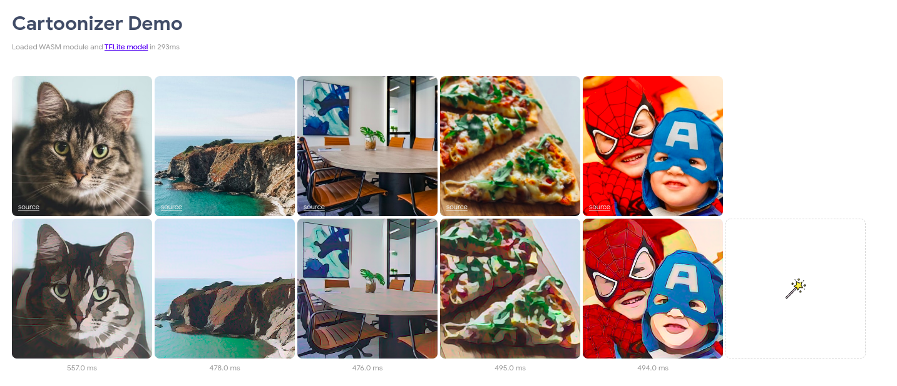

# Run TFLITE model on the web

Using either the [TFJS Task API](https://github.com/tensorflow/tfjs-models/tree/master/tasks) or the [TFLITE Web API](https://github.com/tensorflow/tfjs/tree/master/tfjs-tflite) you can now deploy Tensorflow Lite models on the web without even needing to convert them into Tensorflow.js format. Both libraries are a work in progress and their syntax might change dramatically over the upcoming weeks and months but nonetheless they already allow you to deploy models for lots of different applications, including:
* Image Classification
* Object Detection
* Image Segmentation
* Sentiment Detection
* NL Classification

You can find multiple examples for the above mentioned applications on the Github pages of the libraries as well as on the [TFJS dev Codepen account](https://codepen.io/jinjingforever/pens/public?cursor=ZD0wJm89MSZwPTEmdj01MTY4Nzk3NA==).

## TFJS Task API

The TFJS Task API provides an unified experience for running task-specific machine learning models on the web. It is designed with ease-of-use in mind and it has the following features:
* Easy-to-discover models
* Clean and powerful APIs
* Simple installation

> Note: Currently the library only works with the web browser and doesn't support NodeJS (NodeJS support is a work in progress)

### Resources

* https://codepen.io/jinjingforever/pen/PopPPXo
* https://www.npmjs.com/package/@tensorflow-models/tasks
* https://github.com/tensorflow/tfjs-models/tree/master/tasks

## TFLite Web API

The TFLITE Web API allows users to run arbitrary TFLite models on the web. Users can load a TFLite model from a URL, use TFJS tensors to set the model's input data, run inference, and get the output back in TFJS tensors. Furthermore the library also includes some helper classes that help with certain model types like [Object Detection models](https://github.com/tensorflow/tfjs/blob/master/tfjs-tflite/src/tflite_task_library_client/object_detector.ts#L58).

### Resources

* https://codepen.io/jinjingforever/pen/rNjbWeR
* https://www.npmjs.com/package/@tensorflow/tfjs-tflite
* https://github.com/tensorflow/tfjs/tree/master/tfjs-tflite